```mermaid
graph TD
    %% Nodes and Styles
    style Start fill:#2c3e50,stroke:#333,stroke-width:2px,color:#fff
    style End fill:#2c3e50,stroke:#333,stroke-width:2px,color:#fff
    style AI fill:#e67e22,stroke:#d35400,stroke-width:2px,color:#fff
    style Map fill:#27ae60,stroke:#2ecc71,stroke-width:2px,color:#fff

    Start([📂 Raw UIDAI Data]) --> Process[⚙️ Data Cleaning & ETL]
    
    Process --> |Cleaned Data| Engine{🧠 AI Intelligence Engine}
    
    %% Branch 1: Trend Analysis
    Engine --> |Time Series| Trend[📅 Temporal Analysis]
    Trend --> Insight1[September Surge Detected]
    
    %% Branch 2: Segmentation
    Engine --> |K-Means Clustering| Cluster[👥 Demographic Segmentation]
    Cluster --> |School Share > 40%| Insight2[Target: School Hubs]
    
    %% Branch 3: Forensics
    Engine --> |Isolation Forest| Audit[🕵️ Forensic Auditing]
    Audit --> |Z-Score > 25| Insight3[🚨 Fraud Anomaly Alert]
    
    %% Outputs
    Insight1 & Insight2 & Insight3 --> Dashboard[📊 Executive Dashboard]
    
    %% Final Action
    Dashboard --> |Geocoding API| Map[🌍 Interactive Deployment Map]
    
    Map --> Action1[🚚 Deploy 142 Vans]
    Map --> Action2[👮 Trigger Vigilance Team]
    
    Action1 & Action2 --> End([✅ Optimized Operations])
```

# UIDAI-HACKATHON
# 👁️ Project Drishti: Predictive Intelligence for Aadhaar
### *Data-Driven Resource Allocation & Anomaly Detection Framework*


---

---
## 📌 Overview
**Project Drishti** is an advanced analytics framework designed to optimize the Aadhaar ecosystem. By integrating **Unsupervised Machine Learning**, **Forensic Statistical Auditing**, and **Live Geospatial APIs**, the system transforms static enrollment data into actionable field intelligence.

It solves three critical challenges:
1.  **Resource Mismatch:** Predicting exactly where to send Mobile Vans to reduce wait times.
2.  **Data Integrity:** Automatically detecting non-organic/fraudulent data patterns using Benford's Law.
3.  **Operational Latency:** Reducing decision time from days to seconds via interactive maps.

---
## 🛠️ Technology Stack

| Component | Technology | Role in Project "Drishti" |
| :--- | :--- | :--- |
| **Programming Language** |  | Core application logic and ETL pipeline. |
| **Machine Learning** | **Scikit-Learn (Sklearn)** | Powers the **K-Means Clustering** (Segmentation) and **Isolation Forest** (Anomaly Detection) models. |
| **Data Processing** | **Pandas & NumPy** | High-performance data manipulation, cleaning, and normalization of 1M+ records. |
| **Geospatial API** | **Geopy (Nominatim)** | Connects to **OpenStreetMap** to fetch real-time Latitude/Longitude coordinates for target districts. |
| **Interactive Mapping** | **Folium** | Generates the standalone HTML heatmap (`deployment_map.html`) with interactive pins. |
| **Visualization** | **Matplotlib & Seaborn** | Renders the 6-panel static executive dashboard for trend analysis and forensics. |
| **Automation** | **OS & Webbrowser** | Handles file path resolution and auto-launches the browser interface for a "Zero-Touch" experience. |

---

## 🚀 Key Features

### 1. 🧠 AI-Driven Segmentation (Clustering)
* **The Problem:** Traditional analysis uses simple thresholds (e.g., "Top 10 Districts"), which misses nuanced patterns.
* **Our Solution:** We deployed **Unsupervised Machine Learning (K-Means Clustering)** to dynamically segment districts into three distinct profiles:
    * 🎓 **School Hubs:** High density of 5-17 year olds (Priority Target).
    * 👶 **Birthing Centers:** High density of 0-5 year olds.
    * 🏢 **General Population:** Standard distribution.

### 2. 🕵️ Forensic Data Auditing (Benford's Law)
* **The Problem:** Manual audits cannot detect subtle, systemic data fabrication or "bot-farming."
* **Our Solution:** An automated forensic module that verifies data integrity using **Benford’s Law**.
    * It statistically analyzes the leading digits of enrollment counts.
    * **Outcome:** Instantly flags non-organic data patterns that deviate from natural frequency laws (e.g., fraudulent bulk uploads).

### 3. 🌍 Live Geospatial Command Center
* **The Problem:** Field officers struggle to translate spreadsheet lists into geographical routes.
* **Our Solution:** A "Zero-Touch" mapping engine powered by **OpenStreetMap (Nominatim API)**.
    * **Smart Geocoding:** Automatically fetches real-time GPS coordinates for target districts.
    * **Interactive UI:** Generates a zoomable HTML heatmap (`deployment_map.html`) where pins display exact resource requirements.

### 4. 🚚 Algorithmic Resource Optimizer
* **The Problem:** "Send more vans" is too vague. Over-provisioning wastes fuel; under-provisioning causes queues.
* **Our Solution:** A deterministic logic engine that calculates the **Hardware Requirements** based on daily throughput.
    * **Formula:** `Vans_Needed = Ceiling(Monthly_Load / Daily_Capacity_50)`
    * **Result:** We derived a precise requirement of **142 Mobile Vans** for the top 10 districts, ensuring zero resource wastage.

---

## 📂 Project Structure

```text
📦 UIDAI-HACKATHON
 ┣ 📂 data                           # Data Folder (CSV Files)
 ┃ ┣ 📜 api_data_aadhar_enrolment_0_500000.csv
 ┃ ┣ 📜 api_data_aadhar_enrolment_500000_1000000.csv
 ┃ ┗ 📜 api_data_aadhar_enrolment_1000000_1006029.csv
 ┣ 📜 project_drishti_analysis.py    # 🚀 MAIN APPLICATION CODE
 ┣ 📜 dashboard_combined.png         # Generated Analysis Image
 ┣ 📜 deployment_map.html            # Generated Interactive Map
 ┗ 📜 README.md                      # Project Documentation                 # Project Documentation
```
---
## 📊 Methodology & AI Models

### 1. Unsupervised Clustering (K-Means)
Instead of manual thresholds, we used **K-Means Clustering** to segment districts based on their demographic ratio (New Births vs. Student Updates).
* **Result:** Identified **178 High-Priority Districts** where student workload > 40%, making them ideal targets for "School Camp" interventions.

### 2. Anomaly Detection (Isolation Forest)
We implemented the **Isolation Forest** algorithm to detect non-linear outliers in pincode activity.
* **Result:** Filtered millions of transactions to flag exactly **5 Critical Pincodes** for immediate vigilance audit.

---

## 📊 Visual Insights & Dashboard

The system automatically generates a **6-Panel Executive Dashboard** (`dashboard_combined.png`) that provides a 360-degree view of the Aadhaar ecosystem.

### 1. 📈 Temporal Analysis (Panel 1)
* **Visual:** Line Chart.
* **Insight:** Identifies the **"September Surge,"** a recurring spike in enrollment activity. This allows the administration to pre-stock inventory (forms/ink) one month in advance.

### 2. 🧠 AI Segmentation (Panel 2)
* **Visual:** K-Means Scatter Plot.
* **Insight:** Clearly separates districts into **"School Hubs" (Green)** vs. **"Birthing Centers" (Purple)**. This proves that a "one-size-fits-all" strategy fails, and resources must be specialized (e.g., School Camps vs. Hospital Desks).

### 3. 🚨 Fraud Detection (Panel 4)
* **Visual:** Isolation Forest Anomaly Score.
* **Insight:** Highlights specific pincodes (e.g., `271xxx`) where activity is statistically impossible (top 0.1% outliers), flagging them for immediate physical inspection.

### 4. ⚖️ Forensic Audit (Panel 6)
* **Visual:** Benford’s Law Distribution.
* **Insight:** The blue bars (Actual Data) closely align with the red line (Theoretical Benford Curve).
* **Verdict:** The dataset passes the integrity test, confirming that the enrollments are organic and free from large-scale algorithmic manipulation.

---

### 🗺️ Geospatial Command Center (`deployment_map.html`)

The code also compiles a standalone HTML map for field operations.

* **Live Geocoding:** Converts district names into Latitude/Longitude coordinates via API.
* **Interactive Pins:** Clicking a red target pin reveals the specific operational requirement (e.g., *"Deploy 15 Vans"*).
* **Strategic View:** Allows managers to cluster deployments geographically to save fuel.

> *Note: Run the script to generate these visualizations locally.*

---

## 💻 How to Run

1.  **Clone the Repository**
    ```bash
    git clone [https://github.com/Davish-code/UIDAI-HACKATHON.git](https://github.com/Davish-code/UIDAI-HACKATHON.git)
    cd UIDAI-HACKATHON
    ```

2.  **Install Dependencies**
    ```bash
    pip install pandas seaborn scikit-learn folium geopy
    ```

3.  **Run the AI Engine**
    ```bash
    python project_drishti_analysis.py
    ```

---


## 🔮 Future Scope & Roadmap

Project Drishti is designed as a scalable modular framework. While the current version analyzes historical data dumps, the roadmap includes transition to a real-time enterprise solution.

### 1. ⚡ Real-Time API Integration (Live Mode)
* **Current:** Analyzes static CSV datasets (T-1 Day latency).
* **Future:** Direct API hooks into the UIDAI Central Server to fetch transaction logs in real-time.
* **Impact:** Enables **Instant Crowd Alerts** sent via SMS to District Magistrates when queue density exceeds safety thresholds.

### 2. 🛣️ Dynamic Route Optimization (Graph Theory)
* **Current:** Identifies *which* districts need vans.
* **Future:** Implement **Dijkstra’s Algorithm** or **Google Maps API** to calculate the most fuel-efficient daily route for each mobile van.
* **Impact:** Could reduce fleet fuel consumption by an estimated **15-20%**.

### 3. 🤖 Predictive Hardware Maintenance
* **Current:** Tracks enrollment volume.
* **Future:** Analyze "Biometric Failure Rates" per kit. If a specific machine reports >20% fingerprint rejections, the system will auto-schedule a technician.
* **Impact:** Prevents downtime and reduces citizen frustration caused by faulty sensors.

### 4. 📱 Citizen-Facing Mobile App
* **Current:** Tool for Administrators only.
* **Future:** A lightweight mobile app for citizens to view the "Live Location" of the nearest Mobile Van.
* **Impact:** Democratizes access and ensures citizens don't miss the camp.

---

*Submitted for **UIDAI Data Hackathon 2026** by DAVISH TALREJA*
